# Meet 4 

[Live App](https://meet4.xyz) NOTE: Due to Heroku deprecating their free tier, the live app is currently broken.

[Server Code](https://github.com/arcoleburn/meet4-server)

This project was bootstrapped with [Create React App](https://github.com/facebook/create-react-app).

## About 
Meet4 is an app that helps you meet up with your friends for pizza, coffee or beer, in any city with a subway system. 

## How it works
- Select what you want to meet4: Pizza, Beer, or Coffee
        
- Select one of your saved locations, or input an address from scratch
- Select a friend and select one of their saved addresses, or input their location from scratch
- Hit go!

        
The Meet4 algorithm will find the midpoint between your two locations by subway, and then query Yelp to find a selection of pizza shops, coffee shops, or bars nearby where you can meet your friend. Once you pick one, we use GoogleMaps to get you transit directions right from the app.

All our results have a '$' rating on Yelp, so dont worry about breaking the bank!

## Walkthrough / Screenshots
### Meeting
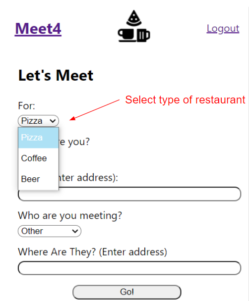
---
---
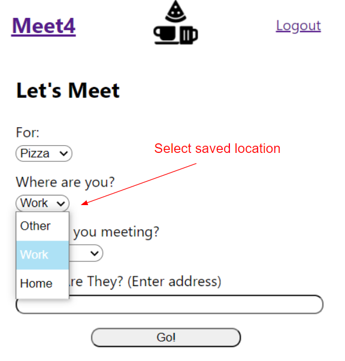
---
---
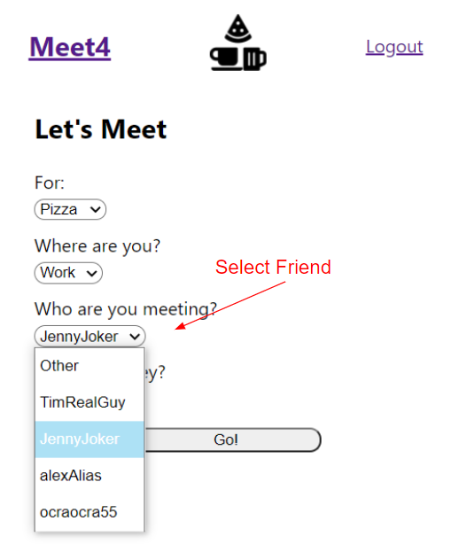
---
---
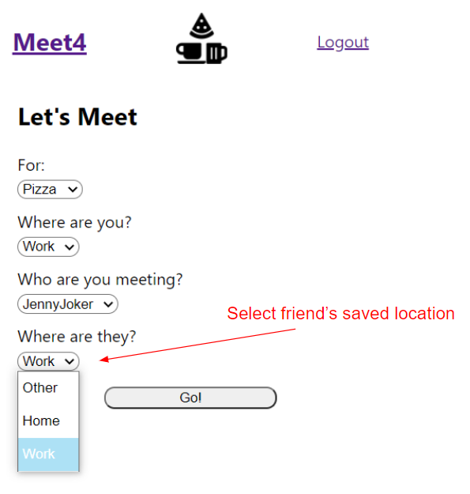
---
---
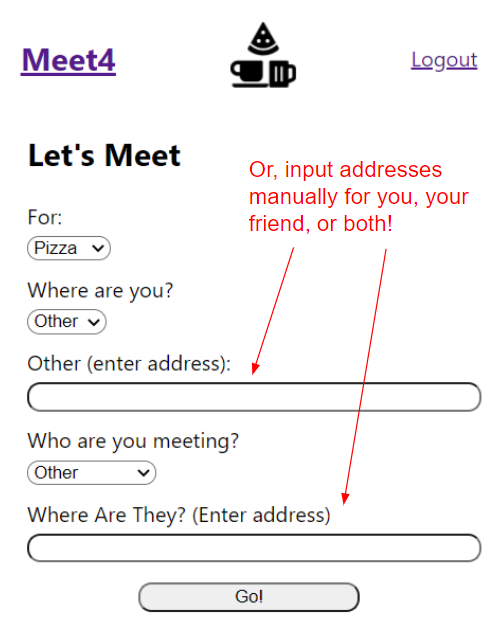
---
---
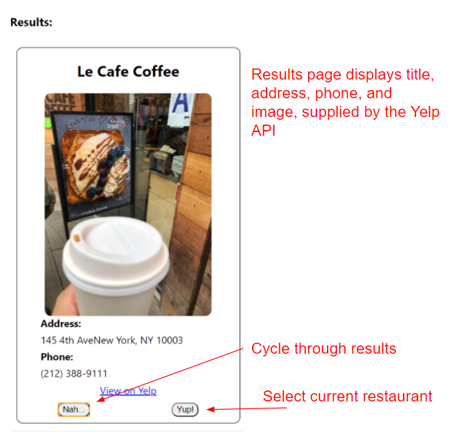
---
---
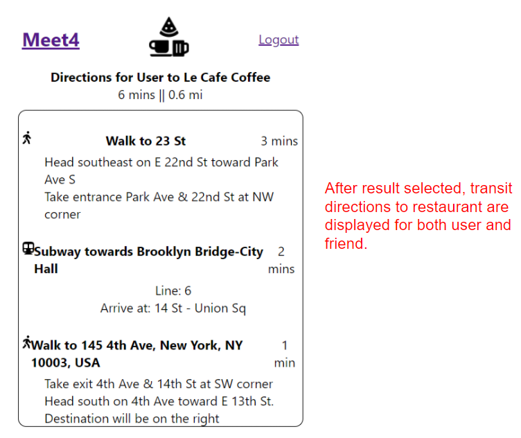
---
---
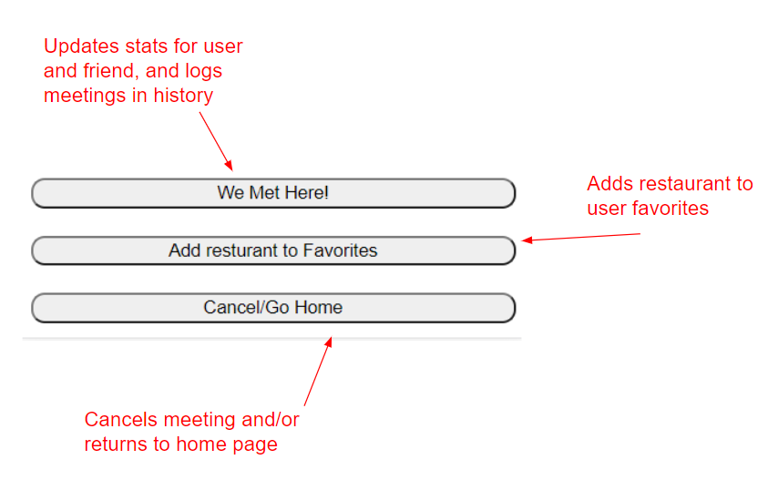
---
---
### User Profile  
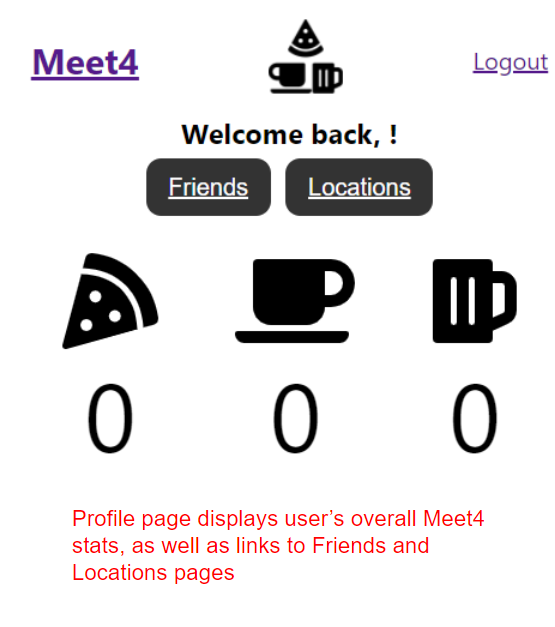
---
---
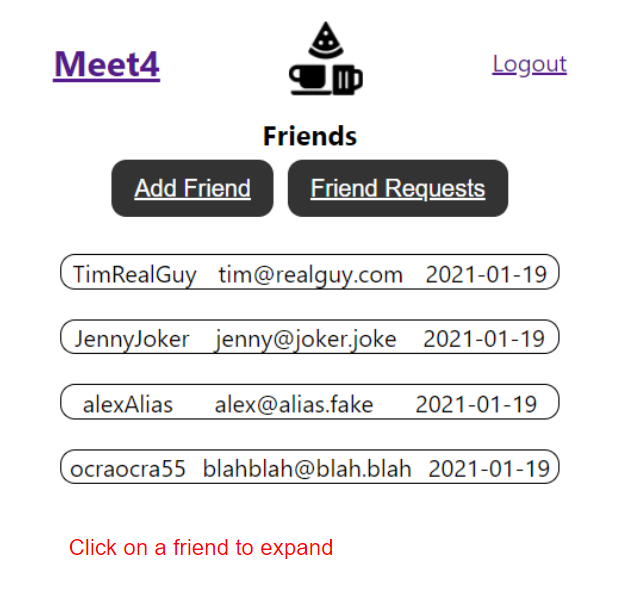
---
---
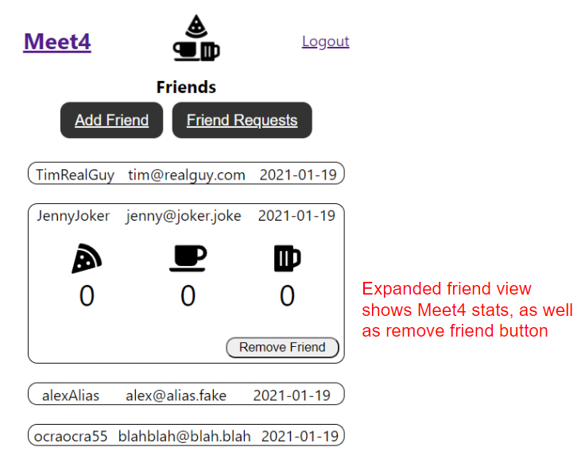

## Friend Request System 
Meet4 uses an asyncronous friend request system. A user can input another user's username to add them as a friend. This creates a friendship in the Meet4 database. When the other user visits their Friend Requests page, they will see an item for each pending friend request.

Should they click accept, the friendship is marked as confirmed, and each user gets access to the others saved locations. 

Should they deny, the frienship is deleted from the database. They same occurs when a user clicks "delete friend" on the expanded friend view. 

## Tech Used 
<b>Client</b>
- React (bootstrapped with Create React App)
- React Router 
- JSON Web Token (for authorization) 
- Styled Components 
- Font Awesome (for icons)

<b>Server</b>

- Node/Express
- PostgreSQL
- Knex 
- node-fetch 
- Node Geometry Library (for distance calculations)

---
<b>Meet4 is powered by the GoogleMaps API and the YelpAPI
